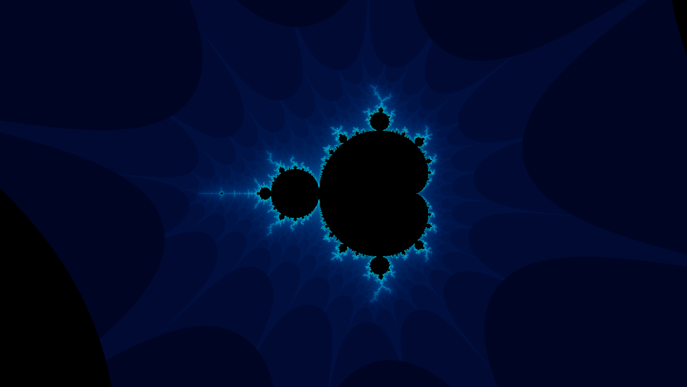

# My GLSL shaders playground



## Mandelbrot set movement controls

### Keyboard

1. Arrow keys (`←`, `→`, `↑`, and `↓`) for moving around
1. `Z` and `X` for zooming in and zooming out
1. `R` to reset everything to the starting point
1. Hold `Alt` to slow down movement and zooming and hold `Shift` to speed it up

### Mouse

1. Drag and Drop (click left mouse button and hold while moving the cursor)
1. Zoom by scrolling the mouse wheel

## How to run

I didn’t try and/or test it outside NixOS but technically if you install
following dependencies you can just run `make run` and it should work for you:

1. GCC
1. GNU Make
1. pkg-config
1. `xxd` executable
1. GLFW3
1. GLEW
1. General OpenGL C header files

### With Nix

Either you enter a Nix Shell and run `make` commands:

``` sh
nix-shell --run 'make run'
```

Or you can build the derivation and run it:

``` sh
nix-build
result/bin/app
```

You can pre-build Nix development environment
(to add a GC root and prevent it from being garbage
collected unless you remove the `result*` symlink):

``` sh
nix-build -A env -o result-env
```

## Known issues

GNU/Make doesn’t recognize changes in `*.glsl` source files for some reason.
So if you just change a shader without cleaning the cache you actually get
previous result. I usually use `touch src/main.cpp && make run` as a hack to not
clean the whole cache. Or you can use this hack for automatically recompile and
run when you save any change in a shader file:

``` sh
while true; do inotifywait -e create src/shaders/** ; touch src/main.cpp && make run; done
```

## Author

Viacheslav Lotsmanov
